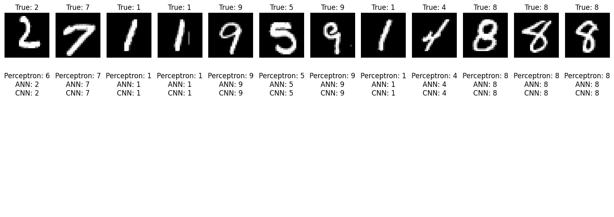

# 🧠 Multilayered Deep Learning Benchmarking Workspace: Perceptron vs. ANN vs. CNN

Welcome to the production-grade workspace dedicated to building, training, and optimizing advanced neural network models. This repository logs a complete evolutionary pipeline of neural architectures trained on a number-based target dataset.

To evaluate feature extraction capabilities and weight optimization strategies, this project builds, evaluates, and benchmarks three distinct architectural designs: **The Single-Layer Perceptron**, **Artificial Neural Networks (ANN)**, and **Convolutional Neural Networks (CNN)**.

---

## 🤵 Repository Host Details

- **Author Name:** amir
- **GitHub Profile Alias:** [amirsohail100](https://github.com/amirsohail100)
- **Official Communication Endpoints:** amirsoahil10@gmail.com
- **Project Status:** Production Ready & Operational 🟢

---

## 🖥️ Application User Interface Preview

Below is the live execution environment, interactive frontend web dashboard, or model prediction performance UI from my local workspace environment:

<div align="center">
  
  <p><i>Deep Learning Interface Dashboard — Real-Time Model Tracking & Accuracy Convergence Plots</i></p>
</div>

---

## 📊 Architectural Performance & Accuracy Comparison

By evaluating all three models under synchronized epochs and identical dataset splits, the empirical results confirm a clear spatial processing hierarchy where **CNN achieved the highest accuracy, followed by ANN, and lastly Perceptron**:

- **🥇 Convolutional Neural Network (CNN) [Highest Accuracy]:** Achieved the top performance score due to its multi-channel 2D kernels and max-pooling operations, which perfectly capture automated spatial hierarchies and image patterns.
- **🥈 Artificial Neural Network (ANN) [Moderate Accuracy]:** Delivered solid intermediate results by flattening structural inputs into fully-connected dense layers to map global weights.
- **🥉 Perceptron [Lowest Accuracy]:** Provided the baseline entry-level score, as a single-layer linear decision boundary fails to isolate complex non-linear patterns.

---

## 🛠️ Core Features & Engineering Objectives

- **Perceptron Baseline Pipeline:** Establishes the foundational linear threshold boundary and computes primitive weighted tensor sums.
- **Multi-Layer ANN Interconnects:** Deploys hidden dense layer blocks (`tf.keras.layers.Dense`) with **ReLU** and **Sigmoid/Softmax** activation parameters to process high-dimensional vectors.
- **Deep CNN Feature Extractors:** Integrates 2D Convolution layers (`tf.keras.layers.Conv2D`) to capture structural grids, combined with Max Pooling (`tf.keras.layers.MaxPooling2D`) for maximum feature stability.
- **Performance Metric Frameworks:** Evaluates structural metrics using Adam or SGD optimizers, categorical/binary cross-entropy loss analysis, and validation accuracy arrays.

---

## 💻 Tech Stack & Dependencies

- **Core Language Infrastructure:** Python 3.10+
- **Primary Deep Learning Framework:** TensorFlow 2.x & Keras API
- **Computer Vision Processing:** OpenCV / Pillow (PIL Array Ingestion)
- **Data Processing & Multidimensional Arrays:** NumPy & Pandas
- **Evaluation Metrics & Pipeline Management:** Scikit-Learn Ecosystem

---

## 🚀 How to Run the Deep Learning Benchmark Locally

Follow these precise steps to deploy and run the comparative analysis smoothly on your local system:

### 1. Clone the Target Endpoint

```bash
git clone [https://github.com/amirsohail100/my_first_deep_learning_with_cnn_basics-Public.git](https://github.com/amirsohail100/my_first_deep_learning_with_cnn_basics-Public.git)
cd my_first_deep_learning_with_cnn_basics-Public
```
